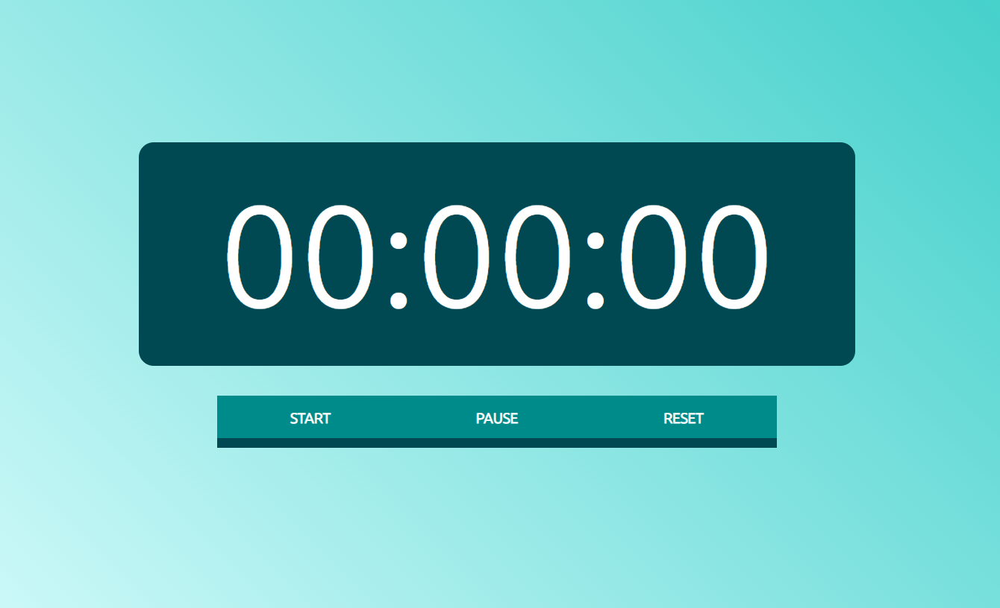

# Cronometro

<!---Esses são exemplos. Veja https://shields.io para outras pessoas ou para personalizar este conjunto de escudos. Você pode querer incluir dependências, status do projeto e informações de licença aqui--->




> Este projeto originalmente foi criado para contar os minutos que eu conseguiria montar um cubo mágico

### Ajustes e melhorias

O projeto ainda está em desenvolvimento e as próximas atualizações serão voltadas nas seguintes tarefas:

- [x] Botão animado
- [x] Ativar pelo teclado
- [ ] Guardar o melhor tempo

## 💻 Pré-requisitos

Antes de começar, verifique se você atendeu aos seguintes requisitos:
* Você tem uma máquina `<Windows / Linux / Mac>`.

## 🚀 Abrindo o Cronometro

Para abrir o Cronometro, siga estas etapas:

Linux, macOS e Windows:
```
Não é preciso instalar nada, você só precisa baixar esse repositório e iniciar o `index.html`
```

## ☕ Usando o Cronometro

Para usar o Cronometro, siga estas etapas:
```
Você pode usar os botões `<START, PAUSE e RESET>` ou:
1- Precionando o espaço e seta para baixo o cronometro é ativado quando é liberada as duas teclas;
2- Precionando apenas o espaço, o cronometro é pausado;
3- A tecla enter reseta.
```

## Demonstração 🕹
https://youtu.be/Dj9syUefv3o


[⬆ Voltar ao topo](cronometro)<br>
